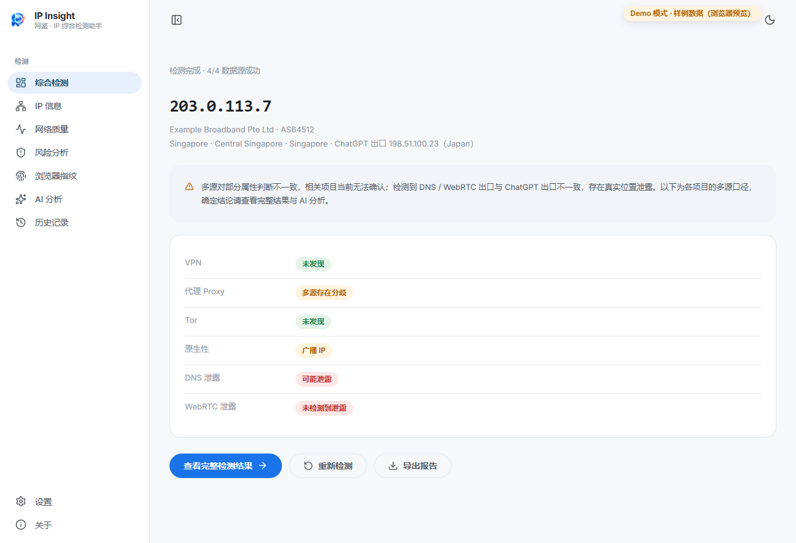
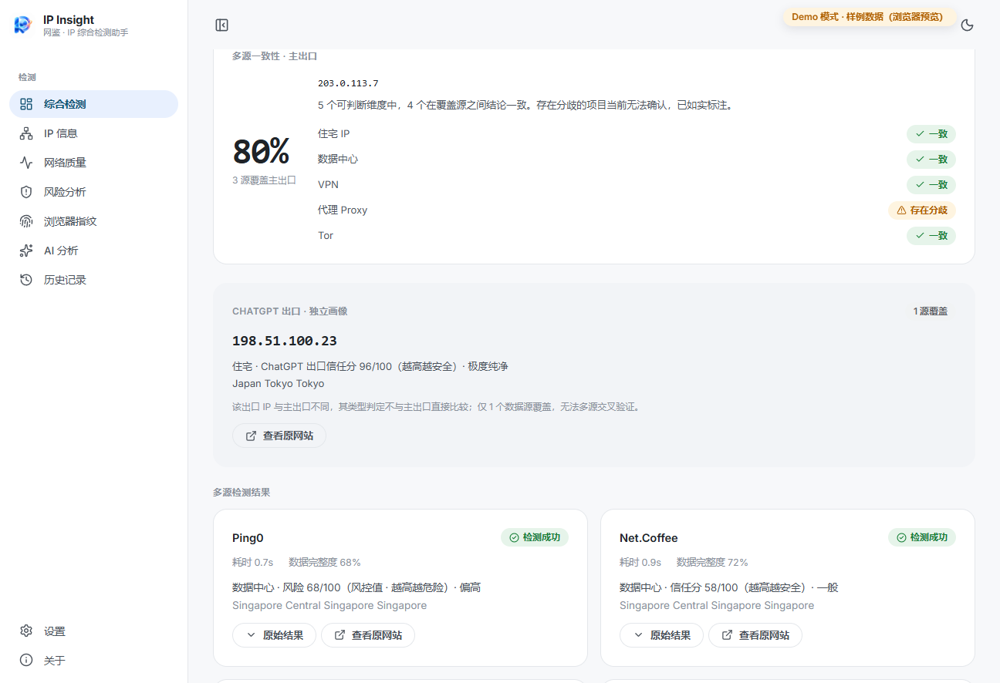
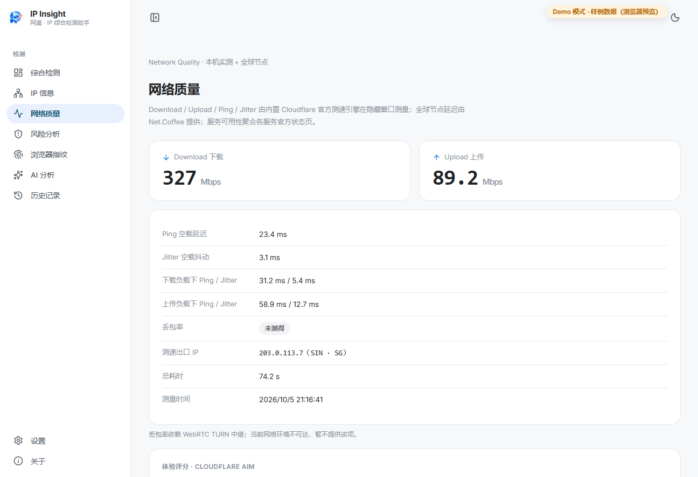
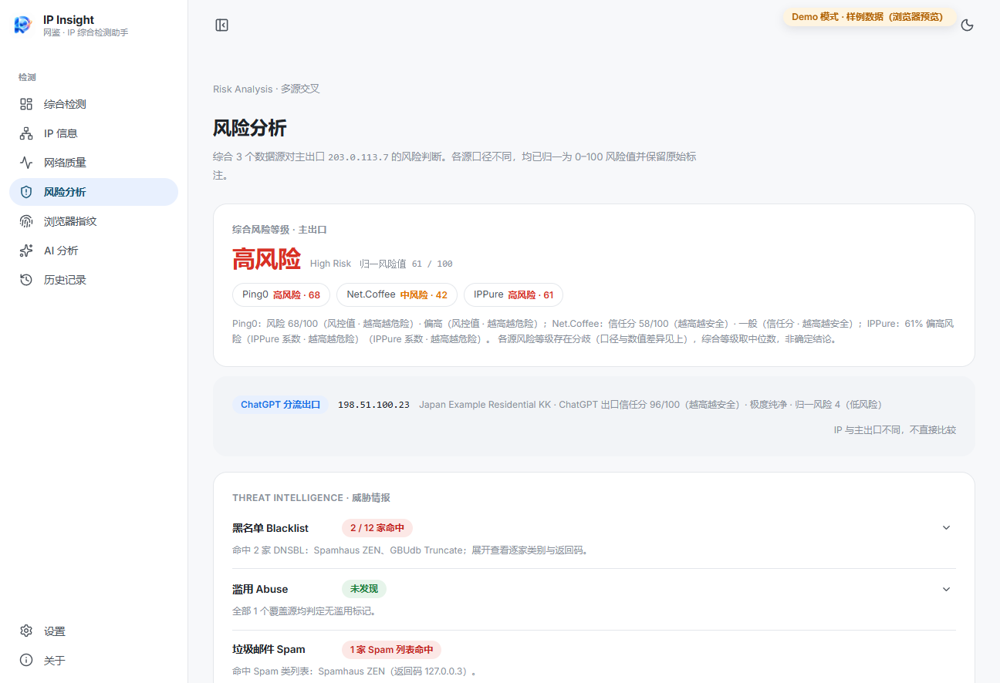
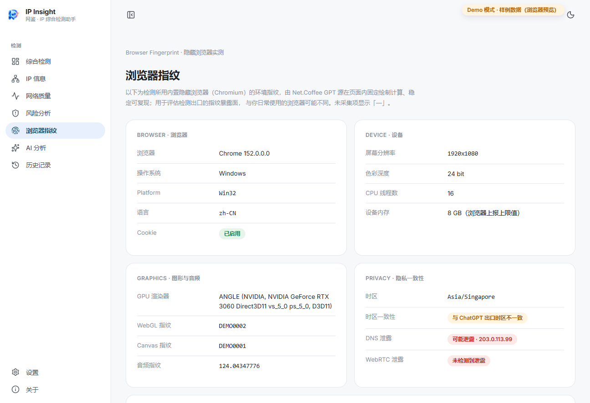
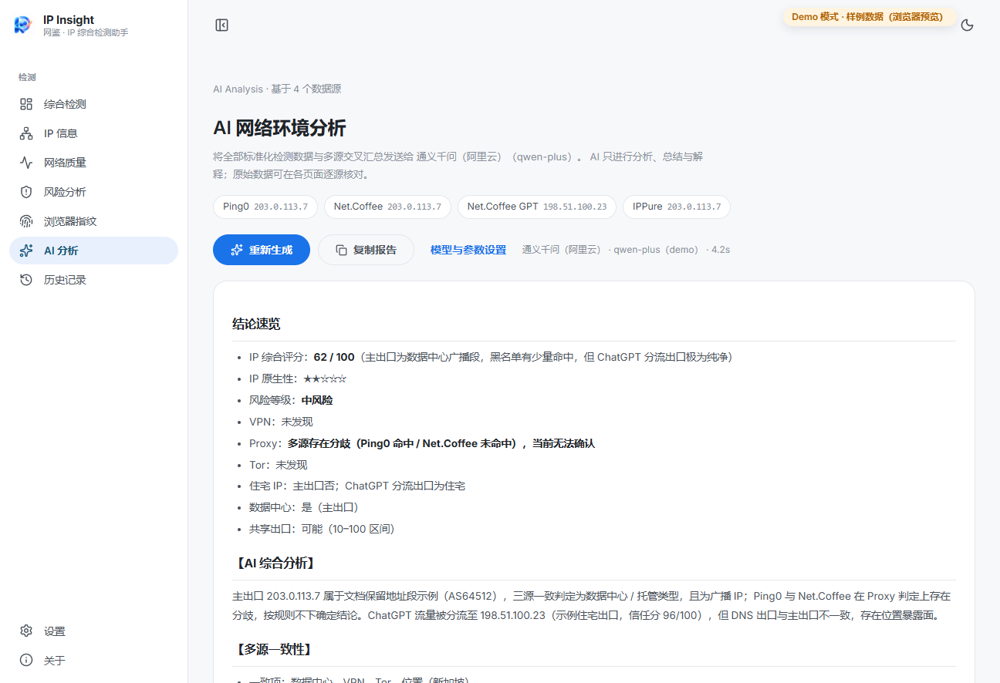
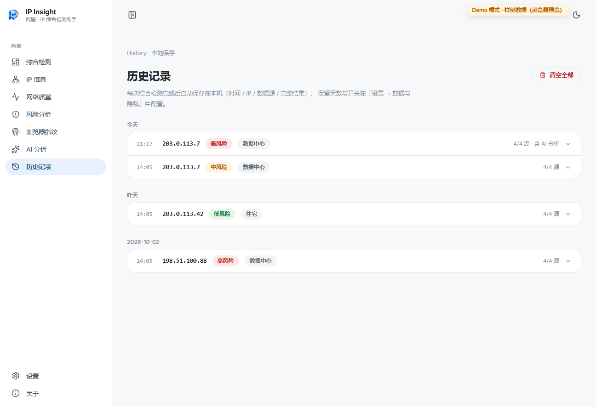
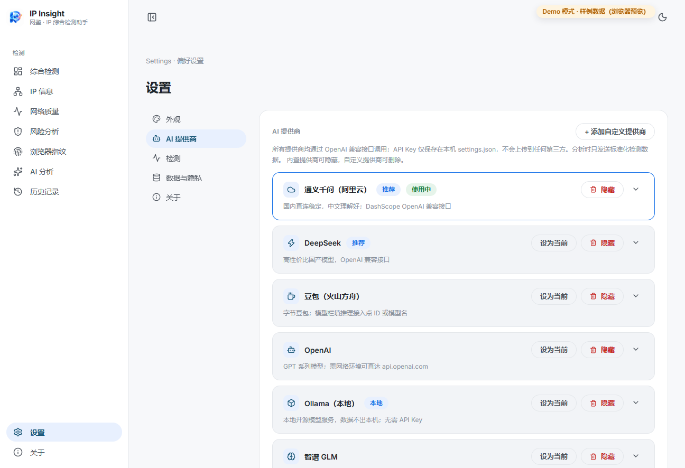

<div align="center">


# Wang Jian · IP Insight

**A Windows desktop assistant for IP network environment inspection: multi-site detection aggregation + data extraction + AI-powered comprehensive analysis.**

[简体中文](README.md) · [English](README_EN.md)


Copyright © 2026 [Xue Ze](https://github.com/xueze-ai)

</div>

---

## Preview

| Comprehensive detection | Multi-source results & consistency |
| :---: | :---: |
|  |  |
| **Network quality (speedtest / global nodes / service status / reachability)** | **Risk analysis (threat intel / proxy & anonymity / nativeness)** |
|  |  |
| **Browser fingerprint (5 groups + detail expansion)** | **AI analysis (streaming report)** |
|  |  |
| **History (day-grouped / reload / export)** | **Settings (AI providers / appearance / detection / privacy)** |
|  |  |

> Screenshots come from the built-in **Demo mode** (browser preview with sample data using RFC 5737 documentation addresses). Run `npm install && npm run build && npm run preview:web` and open the printed URL — no Electron required.

---

## What it is

IP Insight puts your public IP under **multiple independent detection sources** at once: it opens the detection sites automatically, waits for their JavaScript to really execute, extracts the results, normalizes them into one unified data model, then performs **cross-source validation** and **AI comprehensive analysis**, and finally gives you a readable, exportable, revisitable report.

It ships **no IP / threat-intel / GeoIP databases** — every conclusion comes from the live pages & public APIs of the detection sites, plus real measurements on your machine.

### Highlights

- 🌐 **Four sources**: Ping0, Net.Coffee, Net.Coffee GPT, IPPure — one failing source never blocks the others
- 🔎 **Cross-validation**: agreements marked ✓, conflicts marked ⚠ with per-source values; **no forced single verdict**
- 🧠 **AI analysis**: Qwen / DeepSeek / Doubao / OpenAI / **local Ollama** / Zhipu / Moonshot / SiliconFlow / custom — streaming output with automatic continuation on truncation
- ⚡ **Local measurements**: Cloudflare official speedtest engine, 20-node global ping, 31-service availability feed, 10-site reachability probes (real browser network stack)
- 🖐 **Browser fingerprint**: Canvas / WebGL / Audio / Fonts / composite ID + timezone consistency + DNS & WebRTC leak checks
- 🗂 **History & reports**: day-grouped history, reload-into-analysis, export to HTML / PDF / JSON / TXT
- 🎨 **Material 3 desktop UI**: light / dark / follow-system themes (Chinese UI; English docs)
- 🧪 **Demo mode**: preview the entire UI in a plain browser with sample data

## How it works

```
Click "Start comprehensive detection"
        │
        ▼
Main process opens a hidden Chromium window per source
        │  load real page → wait for JS → call the public JSON APIs
        │  the site's own frontend uses / read DOM → extract → normalize
        ▼
NormalizedIPResult unified model (src/shared/types.ts)
        │
        ▼
Group by exit IP → field consensus / conflict flags → nine UI pages
        │
        ├─→ AI analysis (OpenAI-compatible protocol, SSE streaming)
        ├─→ History (userData/history.json)
        └─→ Report export (HTML / PDF / JSON / TXT)
```

**Compliance boundary**: normal browser access only; reads user-visible content; calls only the public endpoints the sites' own frontends call. No captcha solving, no Cloudflare-challenge / login / access-control bypass, no forged requests. Challenge pages surface as "manual verification required".

**Data honesty**: unavailable fields stay empty and render as "— / not measured / no data / undecidable"; cross-source conflicts render as "sources disagree" with per-source values.

## Quick start

### A. Release binaries
See Releases:
- `IP-Insight-<ver>-Setup.exe` — NSIS installer
- `IP-Insight-Portable.zip` — portable, unzip and run `IP-Insight.exe`

No Node / Python / dev environment needed. Unsigned build: on first run SmartScreen may warn — choose "More info → Run anyway".

### B. Build from source
```bash
git clone https://github.com/xueze-ai/IP-Insight.git
cd IP-Insight
npm install

npm run dev            # dev mode (Electron)
npm run build          # build main / preload / renderer
npm run dist           # Windows packaging: NSIS installer + portable zip
```

### C. Browser demo preview (no Electron)
```bash
npm install && npm run build && npm run preview:web
```
Open the printed URL (default http://127.0.0.1:4173/) to browse every page with sample data.

## Daily usage

1. Home → "Start comprehensive detection" (~30–60 s; parallel mode & auto-run-on-start available in Settings)
2. Explore: IP info / Network quality / Risk analysis / Browser fingerprint
3. Settings → AI providers → paste a key (or use local Ollama keyless) → "Test connection"
4. AI analysis page for the streaming report; export from the detection page or history

## AI configuration (incl. Ollama)

Settings → AI providers. Nine built-in OpenAI-compatible providers; built-ins can be hidden and unlimited custom providers added:

| Provider | Default Base URL | Default model |
| --- | --- | --- |
| Qwen (Alibaba) | `https://dashscope.aliyuncs.com/compatible-mode/v1` | `qwen-plus` |
| DeepSeek | `https://api.deepseek.com` | `deepseek-chat` |
| Doubao (Volcano Ark) | `https://ark.cn-beijing.volces.com/api/v3` | endpoint ID (ep-…) |
| OpenAI | `https://api.openai.com/v1` | `gpt-4o-mini` |
| **Ollama (local)** | `http://localhost:11434/v1` | `qwen2.5:7b` (**no key needed**) |
| Zhipu GLM | `https://open.bigmodel.cn/api/paas/v4` | `glm-4-air` |
| Moonshot | `https://api.moonshot.cn/v1` | `moonshot-v1-8k` |
| SiliconFlow | `https://api.siliconflow.cn/v1` | `Qwen/Qwen2.5-7B-Instruct` |
| Custom | yours | yours |

Ollama: run `ollama serve` + `ollama pull qwen2.5:7b` locally, pick Ollama, leave the key empty — your data never leaves the machine.

## Privacy & data locations

| Data | Location | Notes |
| --- | --- | --- |
| Settings (incl. API keys) | `%AppData%/IP-Insight/settings.json` | local only, never uploaded |
| History | `%AppData%/IP-Insight/history.json` | can be disabled / retention-limited / cleared on exit |
| Detection process | memory | nothing written except history |
| Payload sent to AI | normalized results + cross-summary | no keys, no local paths |

No browsing history, files, clipboard or any unrelated data is collected.

## Troubleshooting

| Symptom | Fix |
| --- | --- |
| SmartScreen warning | unsigned build: "More info → Run anyway" |
| A source says "manual verification required" | the site showed a captcha; open the original site, verify, retry |
| Global nodes all "—" | run a comprehensive detection first (data comes from the Net.Coffee source) |
| Packet loss "not measured" | needs WebRTC TURN; unavailable networks get an honest "not measured" |
| AI connection failure | use "Test connection" in Settings to see the provider's real error |
| Reachability differs from your browser | probes follow the **system** proxy; extension-only proxies are not used |
| Packaging downloads time out | set npmmirror mirrors (see issues / Chinese README) |

## Project layout

```
├─ src/
│  ├─ main/                  # Electron main process
│  │  ├─ index.ts            # windows / IPC / regression hooks
│  │  ├─ settings.ts         # persisted settings
│  │  ├─ history.ts          # persisted history
│  │  ├─ exportReport.ts     # HTML/PDF/JSON/TXT reports
│  │  ├─ ai/                 # SSE streaming client / analysis prompt
│  │  └─ providers/          # one Adapter per site + hidden-browser base
│  │     ├─ base/ ping0/ netcoffee/ netcoffee-gpt/ ippure/
│  │     ├─ speedtest/       # Cloudflare official engine
│  │     └─ localprobe/      # site reachability probes
│  ├─ preload/               # contextBridge minimal API surface
│  ├─ renderer/              # React UI (Material 3 design system)
│  │  ├─ src/pages/          # nine pages
│  │  ├─ src/demo/mock.ts    # browser Demo-mode sample API
│  │  ├─ src/state/          # DetectionContext / speedtest / ai / nav stores
│  │  └─ src/utils/          # multi-source consensus / report model
│  └─ shared/                # unified data model / AI provider metadata
├─ resources/Logo.png        # app icon
├─ docs/images/              # preview screenshots
└─ scripts/                  # packaging helpers / web preview server
```

## Contributing

Issues and PRs welcome:
1. Fork and create `feat/xxx` or `fix/xxx` branches
2. Keep the three architectural rules: one Adapter per site, one unified data model, never fabricate data
3. Pass `npm run typecheck:web && npm run typecheck:node && npm run build`
4. Describe motivation, scope and verification in the PR

Be kind, stay on topic, and respect the detection sites' robots & terms of service.

## License

[MIT License](LICENSE): free to use, modify, distribute and sell — **the only condition is keeping the copyright notice (Copyright © 2026 Xue Ze)**. When redistributing, also keep the author & repository information shown in the app's About page.

## Changelog

### 0.1.0 (2026-10-05)
First full release: four source Adapters + unified model, cross-source analysis, nine-page Material 3 UI, local speedtest / global nodes / service availability / reachability, five-group browser fingerprint, streaming AI analysis (9 providers + custom + Ollama), persisted settings, history, four-format report export, NSIS installer & portable zip, browser Demo preview mode.

---

<div align="center">

**Wang Jian · IP Insight** — see your exit IP clearly, every time.

Copyright © 2026 [Xue Ze](https://github.com/xueze-ai) · MIT License

</div>
